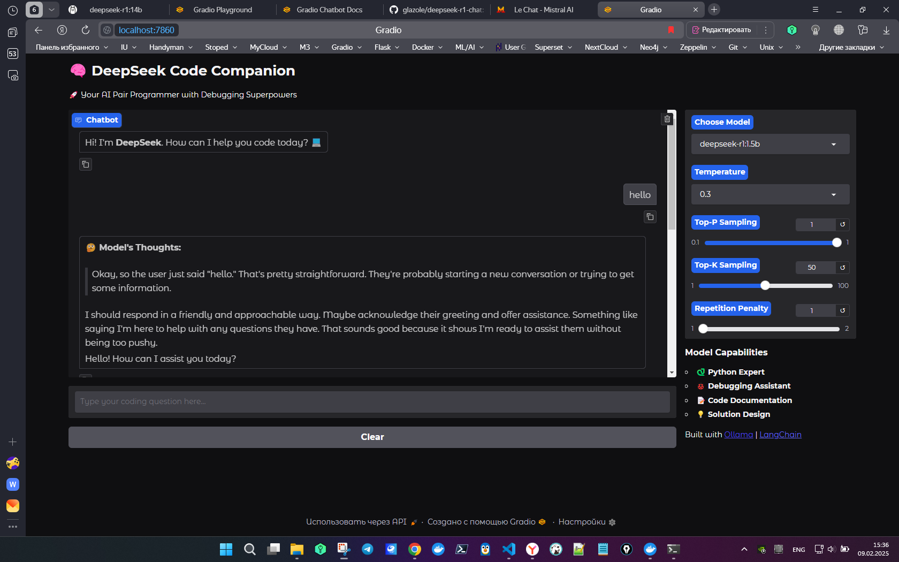

# 🔮 DeepSeek Code Companion запуск в Docker



## 🚀 Обзор

DeepSeek Code Companion — это локальный AI-ассистент для разработчиков, который помогает с кодированием, отладкой и документированием кода. Основан на Gradio и моделях DeepSeek, запущенных через Ollama.

## ✨ Особенности

- 🌐 Запуск в Docker
- 🌍 Интеграция с Ollama
- 🏃‍♂️ Запуск на 100% локально
- 🔒 Приватность ваших данных
- 🌐 English Language

### Добавленные параметры управления моделью

| Добавленный параметр     | Что делает?                          | Как изменяет поведение модели? |
|-------------------------|--------------------------------|--------------------------------|
| **temperature**        | Управляет креативностью         | Выше → ответы разнообразнее   |
| **top_p**             | Ограничивает вероятность выбора слов | Ниже → больше точности, меньше вариаций |
| **top_k**             | Ограничивает количество возможных токенов | Ниже → модель более уверенно выбирает слова |
| **repeat_penalty** | Штрафует модель за повторения   | Выше → меньше повторов, текст разнообразнее |

## 🔥 Ключевые функции

Модель DeepSeek точно настроена для работы с Python, предоставляя:
- Автозавершение кода
- Отладку и исправление ошибок
- Предложения лучших практик
- Советы по оптимизации производительности

### Помощник по отладке

- Стратегические print-выражения
- Анализ ошибок
- Пошаговое решение проблем
- Отладка ошибок времени выполнения

### Документирование кода

- Автоматическое создание docstring
- Объяснение кода
- Предложения по комментариям
- Лучшие практики документирования

### Проектирование решений

- Рекомендации по архитектуре
- Паттерны проектирования
- Структура кода
- Обсуждение масштабируемости

## 🛠️ Перед запуском

1. **Docker** и **Docker Compose** должны быть установлены на вашем устройстве.
2. **Данная сборка расчитана на работу с GPU**, убедитесь, что все драйверы NVIDIA и CUDA у вас установлены.

## 🌍 Запуск в Docker

1. **Клонируем репозиторий:**

   ```bash
   git clone https://gitverse.ru/glazkov-oleg/deepseek-r1-distill-chat.git
   cd deepseek-r1-distill-chat
   ```

2. **Запускаем Docker:**

   ```bash
   docker compose up --build -d
   ```

3. **Откройте браузер и перейдите по адресу:**

   `http://localhost:7860`

## 💡 Примечания

- При первом запуске Docker сам подтянет модели DeepSeek.
- Если сервер не запускается, проверьте логи `docker logs ollama`.

## 🚀 Как использовать

1. Введите вопрос по коду 
2. Получите ответ от AI 
3. Проверьте результат и поправьте код
4. Отрегулируейте параметры модели

## 🛠️ Кто может использовать?

- Программисты и архитекторы
- Аспиранты и студенты IT-специальностей
- Все, кто хочет погрузиться в AI-кодинг

## 💡 Советы для лучших результатов

1. Формулируйте свои вопросы точно
2. Предоставляйте контекст при запросах о коде
3. Используйте модель 1.5b для быстрых ответов
4. Используйте модель 7b для решения досточно сложных задач
5. Используйте модель 14b для вашего супер-интеллекта

## 🔄 Обновления и поддержка

Оставайтесь в курсе последних обновлений:

```bash
git pull origin main
pip install -r requirements.txt
```

## 🙏 Благодарности

- Команде DeepSeek за создание удивительной модели
- Команде Ollama за возможность локальной работы с LLM
- Команде LangChain за отличный фреймворк
- [Rizwankaka][repo-link]

[repo-link]: https://github.com/Rizwankaka/deepseek-r1-chat.git

---

Проект выполнен glazole с ❤️ для сообщества!

---

⭐ Если вам понравился проект, поддержите его звездочкой!
